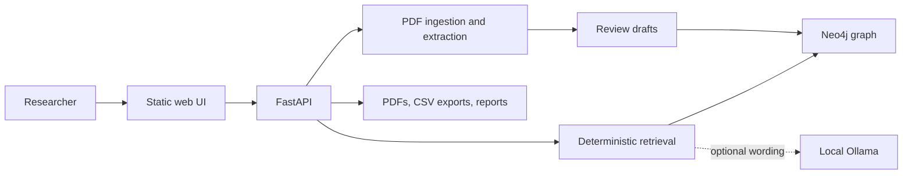

# MIAGE Thesis Knowledge Graph + Retrieval

Local application for importing MIAGE dissertation PDFs, reviewing extracted metadata, building a Neo4j knowledge graph, and retrieving related dissertations with transparent sources.

## Problem and scope

Academic dissertation collections are difficult to explore as folders of PDFs. This project turns reviewed metadata into graph relationships and offers search, graph exploration, CSV export, and local retrieval. It is designed for local research work, not public multi-user hosting.

## Main capabilities

- batch PDF upload with duplicate detection
- metadata extraction with review, approval, and discard states
- Neo4j nodes and relationships for dissertations and their metadata
- filtered dissertation search and profile pages
- interactive knowledge-graph views
- CSV export and dataset validation
- source-linked retrieval with relevance thresholds and pagination
- optional local Ollama suggestions for extraction review and answer wording

## Architecture



Neo4j is the metadata source of truth. The filesystem holds imported PDFs, staging files, exports, graph snapshots, and reports. FastAPI serves JSON endpoints and the static HTML/CSS/JavaScript interface.

## Retrieval behavior

The default `local-hash-v1` implementation is deterministic and local. It tokenizes configured metadata fields, expands a bounded vocabulary, hashes weighted features into fixed-size vectors, and combines vector and sparse-feature similarity. These are hash-based feature vectors, not neural semantic embeddings. Results include their source dissertations and scores.

Ollama is optional. When enabled, it can suggest extraction corrections or phrase a response from retrieved sources. Retrieval, graph construction, and the rest of the application work without it.

## Stack

Python 3.11+, FastAPI, Neo4j, Docker Compose, pypdf, PyMuPDF, RapidOCR fallback, pytest, and Playwright.

## Quick start on Windows

Requirements: Python 3.11+ and Docker Desktop.

```bat
setup_windows.cmd
run_app_windows.cmd
```

Open `http://127.0.0.1:8000`. Neo4j Browser is available at `http://127.0.0.1:7474`.

A fresh setup creates an ignored `.env` with a unique local Neo4j password before Compose starts. Neo4j ports bind to `127.0.0.1` by default.

## Manual setup

```powershell
python -m venv .venv
.\.venv\Scripts\Activate.ps1
python -m pip install -r requirements.txt
python scripts/setup_project.py --prepare-env-only
docker compose up -d neo4j
python scripts/setup_project.py
python scripts/doctor.py
python scripts/run_web_app.py --port 8000
```

## Configuration

Copy `.env.example` to `.env` or run the environment preparation command. Required connection settings are:

```env
MIAGE_NEO4J_HTTP_PORT=7474
MIAGE_NEO4J_BOLT_PORT=7687
MIAGE_NEO4J_URI=bolt://127.0.0.1:7687
MIAGE_NEO4J_USER=neo4j
MIAGE_NEO4J_PASSWORD=
MIAGE_NEO4J_DATABASE=
```

See `.env.example` for data directories, upload limits, retrieval settings, and optional Ollama settings. If Windows reserves either default host port, set `MIAGE_NEO4J_HTTP_PORT` and `MIAGE_NEO4J_BOLT_PORT` to available ports and keep `MIAGE_NEO4J_URI` aligned with the Bolt port. Bindings remain limited to `127.0.0.1`. Changing `.env` does not rotate the password inside an existing Neo4j volume; update both together.

## Tests and validation

```powershell
python -m pytest -q
python scripts/validate_dataset.py
python scripts/validate_knowledge_graph.py
python scripts/validate_embeddings.py
```

The CI workflow installs `requirements.txt` and runs the pytest suite. Browser tests require Playwright Chromium. Integration commands that connect to Neo4j require Docker to be running.

## Reproducibility and evaluation

The test suite covers extraction, import workflow, graph construction, retrieval ranking, API routes, and UI behavior. Dataset and retrieval validators provide reproducible checks against local input data. No accuracy figure is claimed because the repository does not ship a fixed, labeled evaluation corpus.

Dependencies remain expressed as compatible ranges in `requirements.txt`. An exact lockfile was not generated from the current machine because its existing virtual environment points to a removed Python installation; committing a freeze from an unrelated environment would reduce reproducibility.

## Sample data and privacy

Use synthetic or authorized PDFs for demonstrations. Imported dissertations and generated exports under `data/` are local working data and should be reviewed before publication.

## Limitations

- intended for trusted local, single-user operation
- Neo4j and uploaded files are not hardened for public hosting
- OCR and metadata extraction require human review
- hash-based retrieval captures configured lexical features and expansions; it is not a neural semantic model
- optional Ollama quality and latency depend on the locally installed model and hardware
- no hosted demo is currently verified

## Project structure

- `src/web/`: FastAPI routes and static frontend
- `src/ingestion/`: upload and import workflow
- `src/extraction/`: PDF text and metadata extraction
- `src/nlp/`: keyword and concept extraction
- `src/graph/`: graph model and Neo4j access
- `src/rag/`: deterministic retrieval and optional answer generation
- `scripts/`: setup, export, validation, and maintenance commands
- `docs/`: user and technical guides
- `tests/`: automated regression coverage

## Documentation

- [Quick start](docs/quickstart.md)
- [User guide](docs/user_guide.md)
- [Web application](docs/web_app.md)
- [Knowledge graph schema](docs/knowledge_graph_schema.md)
- [Knowledge graph queries](docs/knowledge_graph_queries.md)
- [Retrieval details](docs/rag.md)

## Status and licensing

Active academic portfolio project. No open-source license has been granted yet; the source is publicly visible for review, but reuse rights are reserved until a license is selected.
