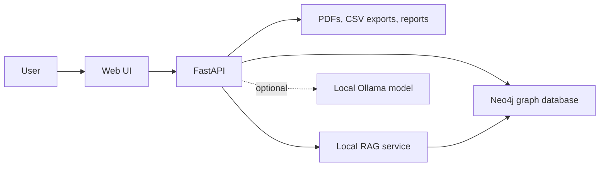

# MIAGE Thesis Knowledge Graph + RAG

## English

### Overview

This project is a local, free web application for managing MIAGE thesis PDFs and exploring them through a Neo4j Knowledge Graph and a local RAG layer.

The application can:

- upload one PDF or multiple PDFs together;
- extract structured thesis metadata from the first pages of each PDF;
- review, approve, or discard import drafts from the web interface;
- store thesis metadata and graph relationships directly in Neo4j;
- export the full thesis dataset as CSV;
- search theses with filters and pagination;
- open thesis profiles inside the application;
- visualize the Knowledge Graph in the browser;
- ask RAG questions over thesis metadata with source theses, relevance scores, and pagination;
- optionally use a local Ollama model for extraction review suggestions.

No paid API is required. Neo4j Community Edition and Ollama can run locally.

### Architecture

Neo4j is the application source of truth.

- Neo4j stores thesis metadata, import drafts, graph nodes, and graph relationships.
- The filesystem stores PDF files, staged uploads, CSV exports, graph snapshots, and reports.
- FastAPI exposes the web application and JSON endpoints.
- The frontend is static HTML, CSS, and JavaScript.
- RAG uses deterministic local embeddings computed from Neo4j thesis rows at runtime.
- Ollama is optional and only used for local LLM review suggestions.



### Main Stack

- Python 3.11+
- FastAPI and Uvicorn
- Neo4j Community Edition
- Docker Compose for local Neo4j
- static HTML, CSS, and JavaScript
- pypdf, PyMuPDF, and OCR fallback for PDF extraction
- local deterministic embeddings for RAG
- optional Ollama model: `qwen2.5:7b`

### Quick Start On Windows

1. Make sure Docker Desktop is installed and running.

2. Install and initialize the project. This command creates the Python virtual environment, installs dependencies, starts Neo4j with Docker Compose, creates `.env` when missing, and checks the installation:

```bat
setup_windows.cmd
```

3. Start the web app:

```bat
run_app_windows.cmd
```

4. Open:

```text
http://127.0.0.1:8000
```

Neo4j Browser is available at:

```text
http://127.0.0.1:7474
```

Default local credentials are defined in `.env.example`.

### Manual Setup

```powershell
python -m venv .venv
.\.venv\Scripts\Activate.ps1
python -m pip install --upgrade pip
python -m pip install -r requirements.txt
docker compose up -d neo4j
python scripts/setup_project.py
python scripts/doctor.py
python scripts/run_web_app.py --port 8000
```

### Configuration

Copy `.env.example` to `.env` if it does not already exist.

```text
MIAGE_NEO4J_URI=bolt://127.0.0.1:7687
MIAGE_NEO4J_USER=neo4j
MIAGE_NEO4J_PASSWORD=miage-rag-2026
MIAGE_NEO4J_DATABASE=

MIAGE_DATA_DIR=data
MIAGE_RAW_PDF_DIR=data/raw/theses_pdf
MIAGE_PROCESSED_DIR=data/processed
MIAGE_REPORTS_DIR=data/reports
MIAGE_GRAPH_DIR=data/graph
MIAGE_CACHE_DIR=data/cache
MIAGE_STAGING_DIR=data/staging
MIAGE_MAX_UPLOAD_MB=100
```

### Web App Features

- `Dashboard`: dataset and graph overview.
- `Knowledge Graph`: interactive graph map that first asks which metadata categories to load, then maps all theses with the selected concepts, keywords, use cases, methods, years, levels, or tracks. It also includes filters, zoom, and derived analysis links for readable exploration.
- `Thesis Search`: text search, filters, pagination, and thesis profiles.
- `Concepts`: concept index and connected theses.
- `Dataset`: full dataset table with CSV copy/download.
- `Ask / RAG`: local question answering with source theses, relevance scores, threshold filtering, and paginated source results.
- `Import PDFs`: single or multi-PDF upload, metadata review, approval, discard, duplicate detection, and local LLM suggestions when Ollama is available.

### Import Workflow

1. Open `Import PDFs`.
2. Upload one PDF or several PDFs together.
3. The backend extracts metadata from the first pages.
4. A draft is saved in Neo4j.
5. Review extracted fields in the UI.
6. Optionally request local LLM suggestions.
7. Approve the draft.
8. The PDF is copied into `data/raw/theses_pdf`.
9. Thesis metadata and graph relationships are rebuilt in Neo4j.
10. CSV, graph snapshots, and reports are regenerated.
11. RAG immediately sees the new thesis because it reads from Neo4j rows.

### Knowledge Graph Workflow

1. Open `Knowledge Graph`.
2. Select the metadata categories to analyze before loading the map.
3. Click `Load graph`.
4. The map uses all theses from Neo4j, but only draws the selected metadata categories.
5. Use filters, zoom, selection focus, and analysis links to inspect dense graph areas without loading every relationship family at once.

### RAG Behavior

The RAG layer does not force a fixed number of results. It ranks thesis metadata locally and only returns sources above the relevance threshold. This avoids showing unrelated theses when the topic is rare.

Default behavior:

- local deterministic embeddings;
- no paid API;
- Neo4j thesis rows as the source;
- visible relevance scores in the UI;
- maximum 20 sources per page in the UI;
- pagination for larger result sets.

### Useful Commands

```powershell
python scripts/doctor.py
python scripts/export_csv.py
python scripts/build_knowledge_graph.py
python scripts/validate_dataset.py
python scripts/validate_knowledge_graph.py
python scripts/validate_embeddings.py
python scripts/query_knowledge_graph.py summary
python scripts/build_embeddings.py
python -m pytest -q
```

Playwright Chromium is only required for browser UI tests:

```powershell
python -m playwright install chromium
```

### Optional Local LLM

The application works without Ollama. If Ollama is installed, it can help review weak extraction drafts.

```bat
setup_ollama_windows.cmd
```

or:

```powershell
python scripts/setup_ollama.py --install --pull --model qwen2.5:7b
```

The default `.env.example` uses CPU-only Ollama generation:

```env
MIAGE_OLLAMA_NUM_GPU=0
MIAGE_OLLAMA_NUM_CTX=2048
MIAGE_OLLAMA_TIMEOUT=300
```

This is slower than GPU offload, but it avoids CUDA/VRAM failures on small laptop GPUs. On a stronger GPU, set `MIAGE_OLLAMA_NUM_GPU=auto` or another Ollama-supported value.

### Project Structure

```text
src/web/              FastAPI app and web endpoints
src/web/static/       HTML, CSS, and JavaScript frontend
src/ingestion/        PDF import workflow
src/extraction/       PDF text extraction and field extraction
src/nlp/              keyword and concept extraction
src/graph/            graph model and Neo4j query service
src/rag/              local RAG retrieval service
src/llm/              optional local LLM review helpers
scripts/              setup, validation, export, and maintenance commands
docs/                 technical documentation
tests/                unit, API, RAG, Neo4j, and UI tests
data/                 local PDFs, exports, graph snapshots, reports, staging
```

## Francais

### Vue d'ensemble

Ce projet est une application web locale et gratuite pour gerer des memoires MIAGE en PDF, les structurer dans un graphe Neo4j et les interroger avec une couche RAG locale.

L'application permet de:

- charger un PDF ou plusieurs PDFs ensemble;
- extraire les metadonnees importantes des premieres pages;
- relire, approuver ou rejeter les brouillons d'import;
- stocker les memoires et les relations directement dans Neo4j;
- exporter le jeu de donnees complet en CSV;
- rechercher les memoires avec filtres et pagination;
- ouvrir une fiche detaillee pour chaque memoire;
- visualiser le graphe de connaissances dans l'interface;
- poser des questions RAG avec sources, scores de pertinence et pagination;
- utiliser optionnellement Ollama en local pour aider la relecture.

Aucune API payante n'est necessaire.

### Architecture

Neo4j est la source de verite de l'application.

- Neo4j stocke les metadonnees des memoires, les brouillons d'import, les noeuds et les relations du graphe.
- Le systeme de fichiers stocke les PDFs, les imports temporaires, les exports CSV, les snapshots du graphe et les rapports.
- FastAPI expose l'application web et les endpoints JSON.
- Le frontend est en HTML, CSS et JavaScript statiques.
- Le RAG calcule des embeddings locaux deterministes a partir des lignes de memoires lues dans Neo4j.
- Ollama est optionnel et sert uniquement aux suggestions LLM locales.

### Demarrage Rapide Sous Windows

1. Verifier que Docker Desktop est installe et demarre.

2. Installer et initialiser le projet. Cette commande cree l'environnement Python, installe les dependances, demarre Neo4j avec Docker Compose, cree `.env` si necessaire et verifie l'installation:

```bat
setup_windows.cmd
run_app_windows.cmd
```

Ouvrir:

```text
http://127.0.0.1:8000
```

Neo4j Browser:

```text
http://127.0.0.1:7474
```

### Installation Manuelle

```powershell
python -m venv .venv
.\.venv\Scripts\Activate.ps1
python -m pip install --upgrade pip
python -m pip install -r requirements.txt
docker compose up -d neo4j
python scripts/setup_project.py
python scripts/doctor.py
python scripts/run_web_app.py --port 8000
```

### Fonctionnalites

- `Dashboard`: vue globale du dataset et du graphe.
- `Knowledge Graph`: carte interactive qui demande d'abord les categories de metadonnees a charger, puis affiche tous les memoires avec les concepts, mots-cles, cas d'usage, methodes, annees, niveaux ou parcours selectionnes. Elle inclut aussi les filtres, le zoom et les liens d'analyse derives.
- `Thesis Search`: recherche, filtres, pagination et fiche memoire.
- `Concepts`: index des concepts et memoires connectes.
- `Dataset`: table complete et export CSV.
- `Ask / RAG`: questions locales avec sources, scores, seuil de pertinence et pagination.
- `Import PDFs`: chargement simple ou multiple, relecture des champs, approbation, rejet, detection des doublons et suggestions LLM locales si Ollama est disponible.

### Cycle D'import

1. Charger un ou plusieurs PDFs depuis `Import PDFs`.
2. Extraire les metadonnees des premieres pages.
3. Enregistrer un brouillon dans Neo4j.
4. Relire et corriger les champs dans l'interface.
5. Approuver le brouillon.
6. Copier le PDF dans `data/raw/theses_pdf`.
7. Reconstruire les noeuds et relations dans Neo4j.
8. Regenerer les CSV, snapshots et rapports.
9. Le RAG voit immediatement le nouveau memoire car il lit depuis Neo4j.

### Cycle D'exploration Du Graphe

1. Ouvrir `Knowledge Graph`.
2. Selectionner les categories de metadonnees a analyser avant de charger la carte.
3. Cliquer sur `Load graph`.
4. La carte utilise tous les memoires stockes dans Neo4j, mais dessine uniquement les categories selectionnees.
5. Utiliser les filtres, le zoom, le focus de selection et les liens d'analyse pour explorer les zones denses sans charger toutes les familles de relations en meme temps.

### Commandes Utiles

```powershell
python scripts/doctor.py
python scripts/export_csv.py
python scripts/build_knowledge_graph.py
python scripts/validate_dataset.py
python scripts/validate_knowledge_graph.py
python scripts/validate_embeddings.py
python scripts/query_knowledge_graph.py summary
python -m pytest -q
```

### Documentation

- `docs/quickstart.md`
- `docs/user_guide.md`
- `docs/web_app.md`
- `docs/knowledge_graph_schema.md`
- `docs/knowledge_graph_queries.md`
- `docs/rag.md`
