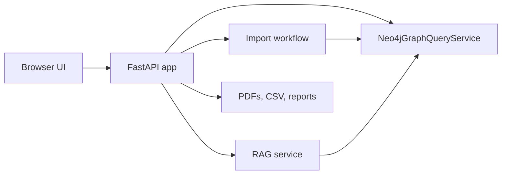

# Web Application

## Role

The web app is the main user interface for the system. It lets a user import PDFs, review extracted metadata, explore the Knowledge Graph, search the thesis dataset, and ask RAG questions.

## Runtime Architecture



Neo4j is the only application data store for structured thesis metadata and graph data.

The filesystem is used for:

- approved PDFs;
- staged uploads;
- CSV exports;
- graph snapshots;
- validation reports.

## Pages

### Dashboard

Shows global dataset and graph metrics from Neo4j.

### Knowledge Graph

Displays a scoped graph map for the UI. The user first chooses the central node type and the categories to load. With `Thesis` as the central node, the backend returns thesis nodes plus only the selected metadata categories. With a metadata type such as `Concept` as the central node, the backend returns a direct metadata graph such as Concept -> Year or Concept -> Keyword. The user can also tick `Thesis` in this mode when they want to see the thesis evidence nodes behind those direct relations.

The graph view includes client-side filters for relation type, concept, use case, year, master level, track, and selected-node focus. These filters only change what is drawn in the browser; Neo4j remains the source of truth.

The graph canvas also supports zoom controls, mouse-wheel zoom, reset, and pan by dragging empty canvas space.

In thesis-centered mode, optional `Analysis links` are derived in the browser from visible thesis paths. If a thesis connects to `Year: 2024` and `Concept: cloud computing`, the UI can draw a weighted analysis link between those metadata nodes. In metadata-centered mode, the backend derives direct weighted links from the selected central metadata type to the other selected categories. The weights count how many theses connect both metadata nodes.

### Thesis Search

Supports:

- text query;
- filters by year, master level, track, use case, methodology, and concept;
- pagination;
- in-app thesis profiles;
- PDF opening from the profile.

### Concepts

Shows the main concepts and connected theses.

### Dataset

Shows the full extracted dataset with pagination and CSV export/copy actions.

### Ask / RAG

Supports:

- local retrieval over Neo4j thesis metadata;
- optional local answer generation style;
- source thesis list;
- visible relevance scores;
- relevance threshold filtering;
- pagination with a maximum of 20 sources per page;
- opening source thesis profiles and PDFs.

The RAG page does not force the system to return an exact number of results. If only a few theses are relevant, only those theses are shown.

### Import PDFs

Supports:

- single PDF upload;
- multi-PDF upload;
- duplicate detection by SHA-256;
- PDF extension, content signature, empty-file, and size-limit validation;
- draft creation in Neo4j;
- field review before approval;
- optional Ollama suggestions;
- approval and discard actions.

## Main API Endpoints

- `GET /api/summary`
- `GET /api/facets`
- `GET /api/dataset`
- `GET /api/dataset.csv`
- `GET /api/graph/map`
- `POST /api/rag/search`
- `POST /api/rag/answer`
- `GET /api/top/{node_type}`
- `GET /api/theses`
- `GET /api/theses/page`
- `GET /api/theses/{thesis_id}`
- `GET /api/theses/{thesis_id}/similar`
- `GET /api/concepts/{concept_label}`
- `GET /api/files/{thesis_id}`
- `POST /api/imports`
- `POST /api/imports/batch`
- `GET /api/imports/{draft_id}`
- `POST /api/imports/{draft_id}/approve`
- `DELETE /api/imports/{draft_id}`
- `POST /api/imports/{draft_id}/llm-suggestions`

### `GET /api/graph/map`

The graph map endpoint supports category-scoped rendering for the web UI.

Use `node_types` as a comma-separated list when the frontend should load all theses with only selected metadata categories:

```text
/api/graph/map?node_types=Concept,Year,UseCase
```

Use `focus_type` to choose the central node type:

```text
/api/graph/map?node_types=Concept,Year,Keyword&focus_type=Concept
```

Without `node_types`, the endpoint keeps the older capped compatibility mode. With `node_types` and `focus_type=Thesis`, the response uses `stats.thesis_scope = "all"` and `stats.thesis_limit = null`. With a metadata `focus_type`, the response uses `stats.graph_mode = "metadata_focus"` and returns `DIRECT_RELATION` edges weighted by shared thesis count. If `Thesis` is included in `node_types`, the response also includes thesis nodes and their original thesis-to-metadata edges.

## Import Approval

When a draft is approved:

1. The staged PDF is copied to `data/raw/theses_pdf`.
2. The approved thesis row is added to Neo4j.
3. Graph nodes and relationships are rebuilt.
4. CSV and graph export files are regenerated.
5. The draft is marked as approved in Neo4j.
6. The staged file is removed.

If graph rebuilding fails after the PDF copy, the app rolls back Neo4j to the previous thesis rows and removes the copied PDF.

## Frontend Rules

The UI is responsive for desktop, tablet, and phone sizes. Large result sets are paginated instead of rendered all at once.

The side navigation uses plain labels without decorative menu icons.

## Tests

The test suite covers:

- API behavior with a fake graph service;
- RAG retrieval and threshold behavior;
- import workflow behavior;
- Neo4j service query generation;
- browser UI smoke tests with Playwright.
