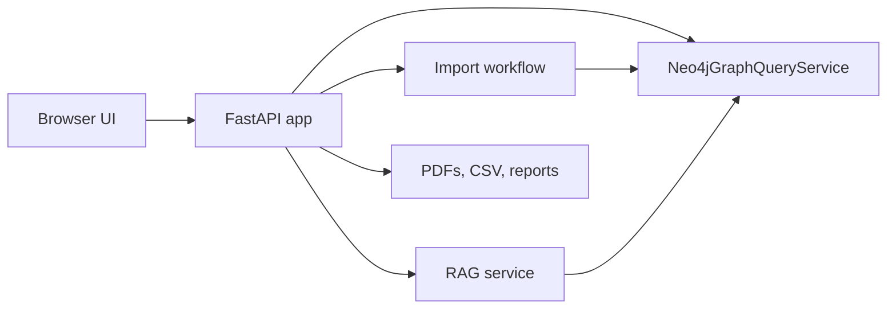

# Web Application

## Role

The web app is the main user interface for the system. It lets a user import PDFs, review extracted metadata, explore the Knowledge Graph, search the thesis dataset, and ask RAG questions.

## Runtime Architecture

Neo4j is the only application data store for structured thesis metadata and graph data.

The filesystem is used for:

- approved PDFs;
- staged uploads;
- CSV exports;
- graph snapshots;
- validation reports.

## Pages

### Dashboard

Shows global dataset and graph metrics from Neo4j.

### Knowledge Graph

Displays a readable capped graph map for the UI. The backend returns a subgraph so the browser remains usable when the dataset grows.

### Thesis Search

Supports:

- text query;
- filters by year, master level, track, use case, methodology, and concept;
- pagination;
- in-app thesis profiles;
- PDF opening from the profile.

### Concepts

Shows the main concepts and connected theses.

### Dataset

Shows the full extracted dataset with pagination and CSV export/copy actions.

### Ask / RAG

Supports:

- local retrieval over Neo4j thesis metadata;
- optional local answer generation style;
- source thesis list;
- visible relevance scores;
- relevance threshold filtering;
- pagination with a maximum of 20 sources per page;
- opening source thesis profiles and PDFs.

The RAG page does not force the system to return an exact number of results. If only a few theses are relevant, only those theses are shown.

### Import PDFs

Supports:

- single PDF upload;
- multi-PDF upload;
- duplicate detection by SHA-256;
- PDF extension, content signature, empty-file, and size-limit validation;
- draft creation in Neo4j;
- field review before approval;
- optional Ollama suggestions;
- approval and discard actions.

## Main API Endpoints

- `GET /api/summary`
- `GET /api/facets`
- `GET /api/dataset`
- `GET /api/dataset.csv`
- `GET /api/graph/map`
- `POST /api/rag/search`
- `POST /api/rag/answer`
- `GET /api/top/{node_type}`
- `GET /api/theses`
- `GET /api/theses/page`
- `GET /api/theses/{thesis_id}`
- `GET /api/theses/{thesis_id}/similar`
- `GET /api/concepts/{concept_label}`
- `GET /api/files/{thesis_id}`
- `POST /api/imports`
- `POST /api/imports/batch`
- `GET /api/imports/{draft_id}`
- `POST /api/imports/{draft_id}/approve`
- `DELETE /api/imports/{draft_id}`
- `POST /api/imports/{draft_id}/llm-suggestions`

## Import Approval

When a draft is approved:

1. The staged PDF is copied to `data/raw/theses_pdf`.
2. The approved thesis row is added to Neo4j.
3. Graph nodes and relationships are rebuilt.
4. CSV and graph export files are regenerated.
5. The draft is marked as approved in Neo4j.
6. The staged file is removed.

If graph rebuilding fails after the PDF copy, the app rolls back Neo4j to the previous thesis rows and removes the copied PDF.

## Frontend Rules

The UI is responsive for desktop, tablet, and phone sizes. Large result sets are paginated instead of rendered all at once.

The side navigation uses plain labels without decorative menu icons.

## Tests

The test suite covers:

- API behavior with a fake graph service;
- RAG retrieval and threshold behavior;
- import workflow behavior;
- Neo4j service query generation;
- browser UI smoke tests with Playwright.
